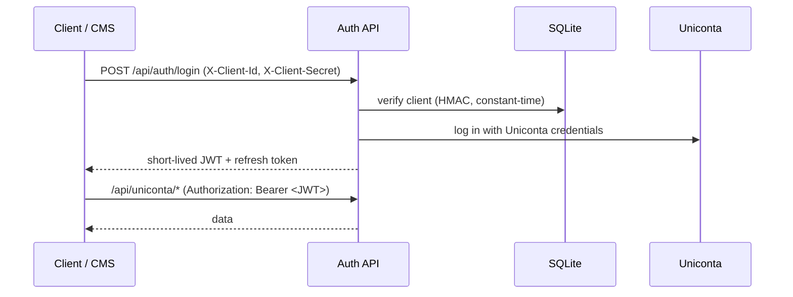
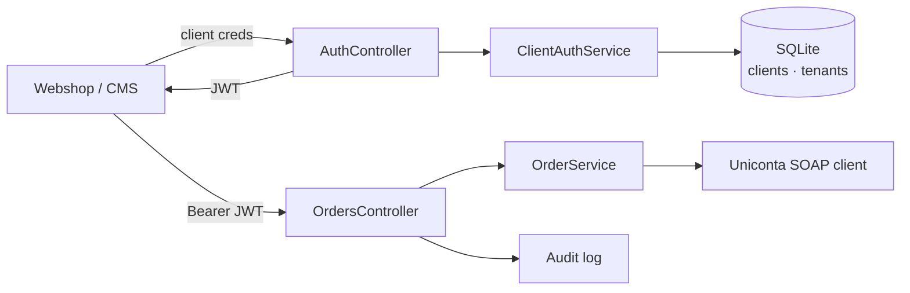

# Softcode Uniconta Middleware

A small **ASP.NET Core (.NET 8)** web API that sits between your webshop / CMS and
**Uniconta ERP**. It turns Uniconta's SOAP SDK into a clean, secured REST API so a
storefront never talks to the ERP directly.

Built for a headless Magento store, but the API is generic and works with any
client that can send an HTTP request.

---

## Why it exists

Uniconta's SDK is powerful but not something you want to expose to the public
internet: it returns rich object graphs, needs ERP credentials on every call, and
has no rate limiting or access control of its own. This middleware wraps it and adds:

- **Stable DTOs** instead of raw SDK objects (no accidental data leaks, no circular graphs)
- **Two-step authentication** — client credentials to log in, short-lived JWTs for every call
- **Credential protection** — Uniconta passwords are encrypted in memory, never returned, never put in a token
- **Rate limiting** on the sensitive login endpoint
- **In-memory caching** to keep ERP load down

---

## How authentication works

Authentication is **token-based**, in two steps:



- **Client secrets** are stored as a **keyed HMAC-SHA256 hash** (with a server-side
  "pepper" from configuration) and compared in **constant time** — a leaked database
  alone cannot be used to recover or brute-force them.
- **JWTs** are short-lived; **refresh tokens** are server-stored, rotated on use, and revocable.
- The Uniconta password is used once at login and cached **encrypted** with a TTL.

---

## API reference

All `api/uniconta/*` endpoints require a valid `Authorization: Bearer <JWT>` header.

| Method | Route | Purpose |
| --- | --- | --- |
| `POST` | `/api/auth/login` | Exchange client credentials for a JWT + refresh token |
| `POST` | `/api/auth/refresh` | Rotate an expired JWT using a refresh token |
| `GET`  | `/api/uniconta/products` | List products (`?offset=&limit=&includeDynamic=`) |
| `GET`  | `/api/uniconta/products/{sku}` | A single product |
| `GET`  | `/api/uniconta/debtors` | List debtors/customers (`?offset=&limit=&includeDynamic=`) |
| `GET`  | `/api/uniconta/debtors/{account}` | A single debtor |
| `POST` | `/api/uniconta/orders` | Push a webshop order into Uniconta |
| `POST` | `/api/uniconta/orders/{orderNumber}/invoice` | Invoice an existing order |

`includeDynamic=true` adds extra flat ERP fields under an `extensions` object
(primitives only — no nested SDK objects).

### Error responses

| Situation | Status |
| --- | --- |
| Missing/invalid client credentials | `401 Unauthorized` |
| Missing/expired/invalid JWT | `401 Unauthorized` |
| Entity not found | `404 Not Found` |
| Login rate limit exceeded | `429 Too Many Requests` |
| Uniconta rejected the operation | `422 Unprocessable Entity` |
| Unexpected error | `500 Internal Server Error` |

Errors are shaped by a global exception middleware; internal details are logged
server-side, never returned to the caller.

---

## Getting started

**Prerequisites:** .NET 8 SDK, and Uniconta API credentials.

```bash
git clone git@github.com:DritonCa/SoftcodeUnicontaMiddleware.git
cd SoftcodeUnicontaMiddleware

# real secrets go in appsettings.Development.json (git-ignored), not appsettings.json
dotnet restore
dotnet run
```

Then open `https://localhost:5001/swagger` for the interactive API explorer.

On first run the app creates a local SQLite database and seeds one demo API client
(the client id + secret are printed to the console).

### Configuration

`appsettings.json` ships with placeholders; put real values in the git-ignored
`appsettings.Development.json` / `appsettings.Production.json`, environment
variables, or user-secrets:

| Key | Meaning |
| --- | --- |
| `Jwt:Key` | Signing key for JWTs (long random string) |
| `Jwt:Issuer` / `Jwt:Audience` | JWT validation values |
| `Auth:SecretPepper` | Server-side key used to HMAC client secrets |
| `Uniconta:ApiKey` / `Username` / `Password` | Uniconta ERP credentials |
| `ConnectionStrings:AppDb` | Optional; overrides the default local SQLite file |

---

## Testing

```bash
dotnet test
```

The `Tests/` project (xUnit) covers the security core — HMAC hashing and client
authentication (correct/incorrect secret, unknown/inactive client, inactive tenant,
empty input) using an in-memory database. CI (`.github/workflows/ci.yml`) runs
`build` + `test` on every push and pull request.

---

## Architecture at a glance



- **Stateless** — no server-side session; every call carries its own JWT.
- **Layered** — thin controllers, business logic in services, ERP access isolated
  behind a client factory, EF Core for persistence.
- **DI-first** — everything is registered in `Program.cs` and injected via constructors.

**Tech:** .NET 8 · ASP.NET Core · Uniconta .NET SDK · EF Core (SQLite) ·
ASP.NET Data Protection · JWT + refresh tokens · built-in rate limiter · `IMemoryCache`.

---

## License

MIT — see [LICENSE](LICENSE).
